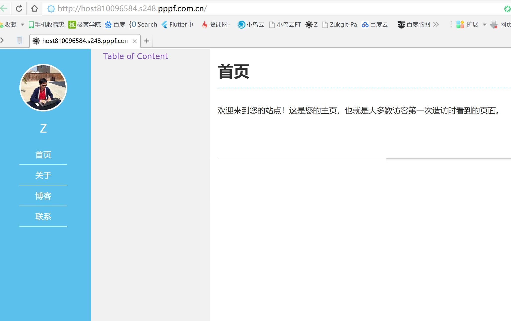
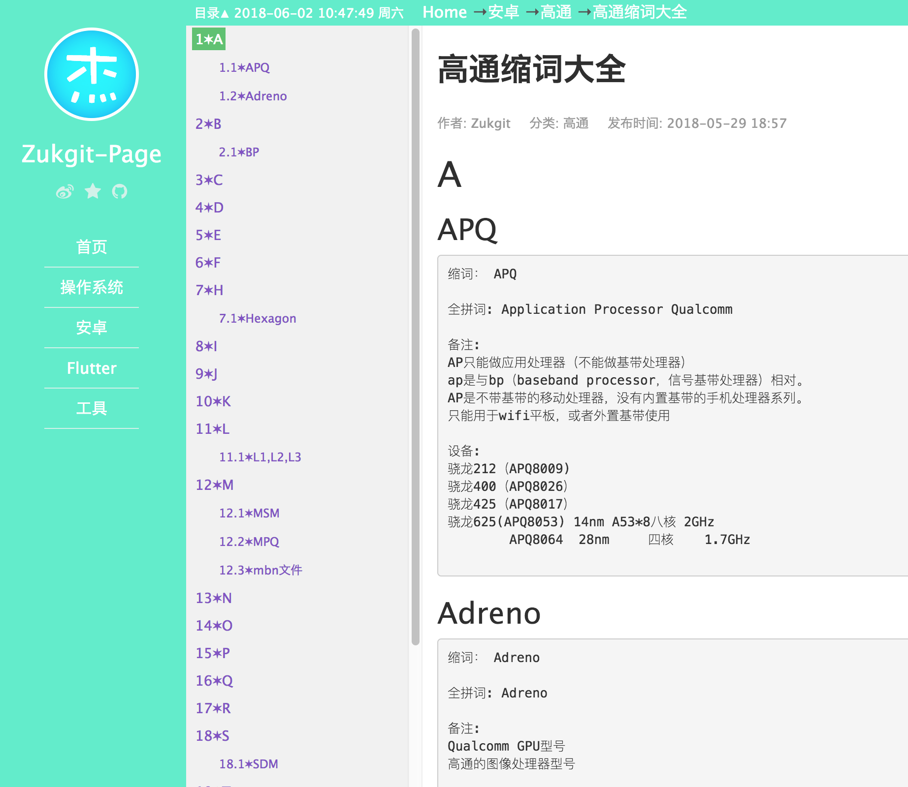
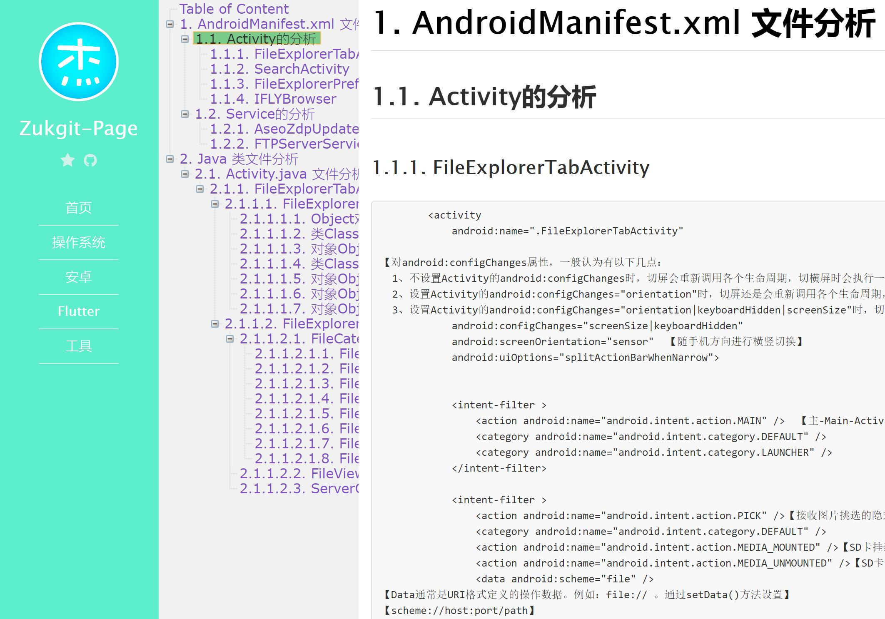
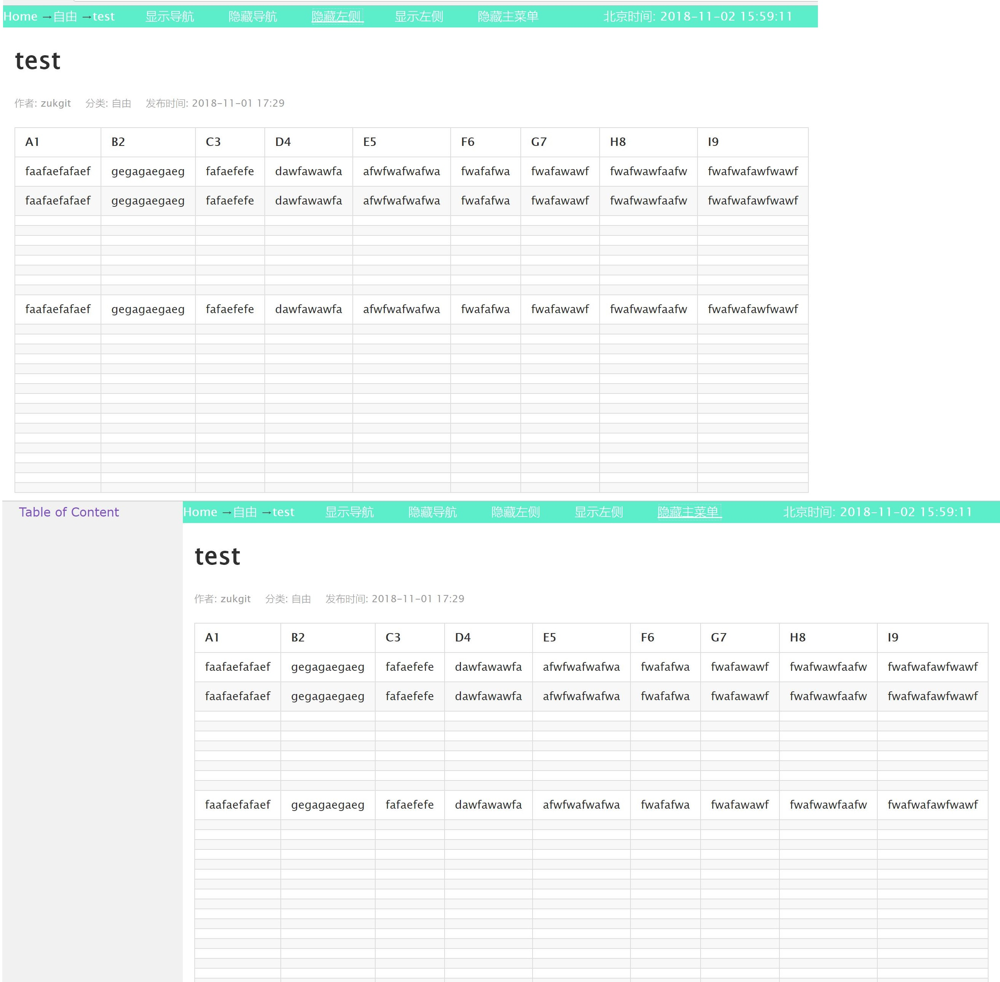

# WordPress重装记录

## 初始模样

## 版本1

## 版本2

## 版本3

##  修改背景颜色
1. 登录    http://host810096584.s248.pppf.com.cn/admin    进入wordpress后台设置
2. 仪表盘 》 外观 》 主题 》 自定义  》 背景颜色 》 
主题风格色调: #5cedcb 蓝腚色

JieStrle设置 》  主题风格色调 》   #5cedcb 蓝腚色
## 定义网页标题 头像图片路径
仪表盘 》 JieStyle设置 》 
首页标题Title 》  Zukgit-Page
首页描述 Description 》 Do All Thing By Self，Do Not Depend Daddy
http://host810096584.s248.pppf.com.cn/wp-content/image/icon_152.png
 
图片在 style2/image 下

## 定义图片背景
http://www.51yuansu.com/   寻找免扣背景图作为背景图片  本地保存有若干背景透明图片

##  外观小工具隐藏
仪表盘 》 外观 》 小工具 》边栏1  》所有item删除

## 固定连接类型
(分类需要定义英文别名)

仪表盘 》 Settings 》 固定链接 》 自定义结构 》  /%category%/%post_id%/  》 保存更改

##  安装插件  Markdown
仪表盘 》 Settings 》 Markdown (使文章支持markdown语法) 勾选  √
安装插件    WP Editor.md

## 备份数据库
小鸟云 》 数据库FTP地址( 区别于网站FTP ) 》 backup 》 xxxx.sql